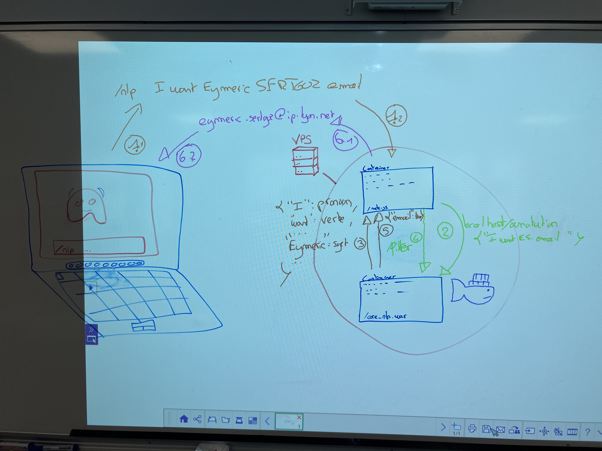

# Node JS & Chatbot

> Eymeric SERTGOZ, Maxime DECORDE, Hugo MERCIER et Emilien DENOT

Dans le cadre de ce module, nous avons choisi d'intégrer une fonctionalité de **Chatbot** au bot discord déjà mis en place dans notre promotion.
Le but serait d'avoir un slash commande particulier pour envoyer des demandes à un bot sous forme de phrase en **langage naturel**.
C'est à dire une phrase compréhensible par une personne et non un ordre haché.

## Technologies utilisés

- **TypeScript** : langage de programmation principal pour l'application de bot discord
- **Discord.js** : framework pour créer et interagir avec le bot discord
- **CoreNLP server** : un serveur permettant des traitements sur du langage naturel

## Fonctionnement

> Le bot ne comprend que l'anglais

> Seule la fonctionalité de recherche du mail d'un apprenant enregistré est possible pour le moment

L'utilisateur fait une demande au **Chatbot** via une commande du **Bot Discord** `/nlp [le text de ma demande]` \
Dans notre cas `/nlp Hi great bot, i wish for Eymeric SERTGOZ email` par exemple.
La phrase *Hi great bot, i wish for Eymeric SERTGOZ email* est transmise au CoreNLP server afin de faire un traitement sur la phrase : cherche ton ue adresse email ?
Si le resultat nous confirme la demande, on requête une nouvelle fois le CoreNLP server afin de trouver si un nom et prénom ont été indiqué.

Finalement si la phrase a du sens et suis les conventions de langage de l'anglais le **ChatBot** peut renvoyer le mail de la personne demandé si celle-ci est bien enregistré dans le **Bot discord**.

Le code relatif au chatbot est contenu dans `src/commands/Nlp.ts`.

## Schema du fonctionnement

> L'utilisateur fait une demande en langage naturel

- 1 : L'application de bureau envoie la demande au **bot discord** ( container docker )
- 2 : Le **bot discord** demande une étude de la phrase au server CoreNLP ( container docker )
- 3 : Le serveur **CoreNLP** analyse la phrase et renvoie le résultat au **bot discord** ( format JSON )
- 4 : Le **bot discord** demande un filtrage (TokenRegex) pour déduire les actions à effectuer au serveur CoreNLP
- 5 : Le serveur **CoreNLP** applique les filtres token sur la phrase et renvoie le résultat au **bot discord** ( format JSON )
- 6 : Maintenant que le **bot discord** a une suite de demande d'action simple il tente de les effectuer s'il a les données necéssaires et réponds à l'application de bureau

